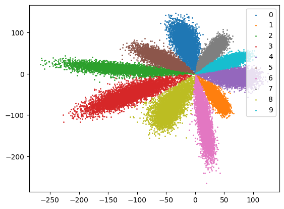

# Center Loss
Implementing center loss with pytorch

### Introduction

[Center loss](https://ydwen.github.io/papers/WenECCV16.pdf) 논문을 읽고 논문 속 toy example로 이해를 확인하고자 했습니다.
학습 데이터셋은 mnist를 사용했습니다.
Lightning을 사용하지 않은 버전은 center_loss.ipynb에서 확인할 수 있습니다.
해당 파일에서는 각각의 loss 함수에 대해 다른 optimizer를 사용했습니다.

### Requirements
After cloning the repo, run this line below:
```
pip install -r requirements.txt
```

### Usage
```
# train
python -m centerloss.train

# inference
python -m centerloss.inference
```
For jupyter notebook, you can comment/uncomment lines that you're going to use/not use.
You can change hyperparameters in cell[5]

### Statistics

##### 1. train summary

| model   | Loss function  | lambda |
|---------|----------------|--------|
| LeNet++ | SoftMax        | -      |
| LeNet++ | SoftMax+Center | 1      |
| LeNet++ | SoftMax+Center | 0.1    |
| LeNet++ | SoftMax+Center | 0.01   |
| LeNet++ | SoftMax+Center | 0.001  |


- optimizer1: SGD(lr=0.01, momentum=0.9, weight decay=0.0005)
- optimizer2: SGD(lr=0.5)
- total epochs: 100
- params: 796K


##### 2. plots

- softmax loss only




- softmax loss + center loss


- softmax loss + center loss with different lambda


